# MoMent-App Documentation

-  The Goal
-  Development Stack
-  Workflow
-  Features

## The Goal

My goal during my 11 week internship was to create a full stack web-application. This Project would help me to solidify my current knowledge with the basics of Web-Development like HTML, CSS and classic Javascript, but also introduce more modern Versions of Front-End Development and also start using a Backend which i didnt have a lot of previous experience with. I decided on implementing a Movie/TV-Series Application, since it fits the all the before moentioned criteria and it is very easy to get data via an API.

## Workflow

-  Chosing the Development Stack
-  Finding Desing Inspiratons
-  Defining the Necessary Features
-  Implementation
-  Defining complementary features
-  Deploying the Website
-  Bug Fixing and Testing

### Chosing a Development Stack

The First step was to choose a programming stack to learn for later development. I decided on the following components:

-  Next-JS
-  TMDB API
-  Supabase
-  Tailwind-CSS

### Next-JS

Next-js is a Framwork for Javascript that includes various libraries and features. The main Porgramming Library is React, which is the most used component-based Javascript library. Next-JS also includes features like server-components, which allow data to be fetched and rendered by the server instead of the client. The NextJs-App router enables the use of dynamic layouts and routes for smooth and fast routing betwenn pages and dynamic content.

### TMDB API

The TMDB API offers the biggest online collection of entertainment media with Millions of movies and TV-shows. The unsage is free to use without limitations which makes it a great api for private projects or begginers that dont want to invest anything right away.
I first started by fetching all my data right from the Api. Later i wrote a script to fetch the MovieData and the safe it to a database. The Images would still be fetched from the Api.

### Supabase

Supabase is a relatively new open-source backend provider. It bascially offers a Development Interface for all the backend functionalities you could need. Supabase is based on PostGreSQL which makes it theoretically possible to export or import data as a regular SQL Database.
There are feature for all kinds of Authentification, like E-mail verification and resetting Passwords. There are a lot of built in filters for fetching Data and even a Storage functionality for storing images and videos.

### Tailwind-CSS

Tailwind-CSS offers preconfigured css styling that is written directly as an elements className. This removes the need to think of classNames for all html-components and creates consistency by providing standardized colorization and sizing. Responsiveness is also easily appliable. More complex stylings can still be defined in css files.

## Technical Feature Description

### Next-JS App-Router

#### Folder-Sructure:

    app
        PageName
            page.jsx
        PageName2
            [parameter]
                page.jsx
        PageName3
            [...parameters]
                page.jsx
        components
            component1.jsx
            component2.jsx
        actions
            action1.js
            action2.js

The next js App-Router enables Page-Routing based on the actual file-structure of your Project. You can create pages by first creating a folder with the name of your page with a page.jsx file inside. Every file called page.jsx will be handled as a seperate Page. Furthermore you can add a subfolder [parameter] or [...parameter] which makes it possible to create either a defined number of path routing parameters or a folder with a dynamic number of parameters.
The components folder stores all the needed React-components whereas the actions folder is used to store serveractions.

Next-js provides Server and Client components which can be defined by using either `'use server'` or `'use client'` at the start of a file. If nothing is defined at the start of a file it will be a server component. It is best Practice to have as many Server components as possible and only use client components if needed to improve performance. Client components are only necessary for user-interaction-events or when its needed to use React Hooks for dynamic content display like `'useState()'` or `'useEffect()'`. For a detailed List of when to use which component-type, view: [This link](https://nextjs.org/docs/app/building-your-application/rendering/composition-patterns)

The Page components import all the Necessary other components. This makes it possible to easily reuse components like a navigataion bar without having to redefine it on every page.

Server actions are a very helpfull feature. They are Functions that run as server components, but can be imported and called inside client components. A server action has to be marked with `'use server'` at the start of the file.

## Functionality

### Landing Page

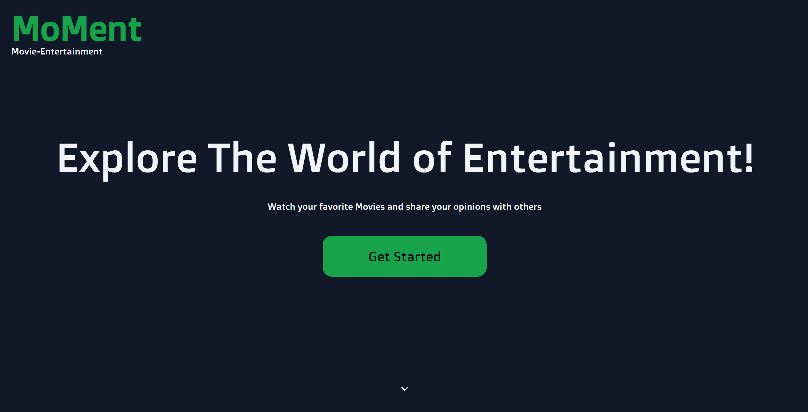

Click on "Get Started!" to get to the Login Page.
Can be scrolled down to see some Information about MoMent.

### Login Page

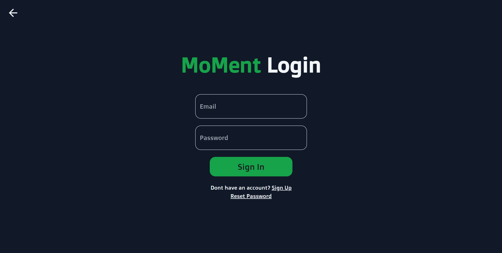

Allows the user to return to the Landing Page.
Sign in with email and password.
Klick on Sign Up to switch from singning in to signing up.
Upon signing up receive an email to verify out identity and sign in afterwards.
Clik on "Reset Password" to get to enter an email for a reset link.

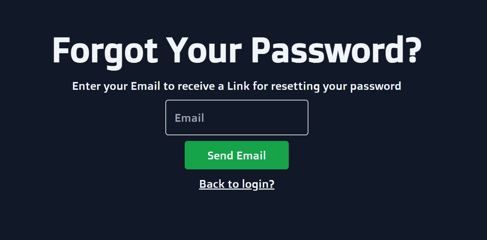{style="height:325px"} 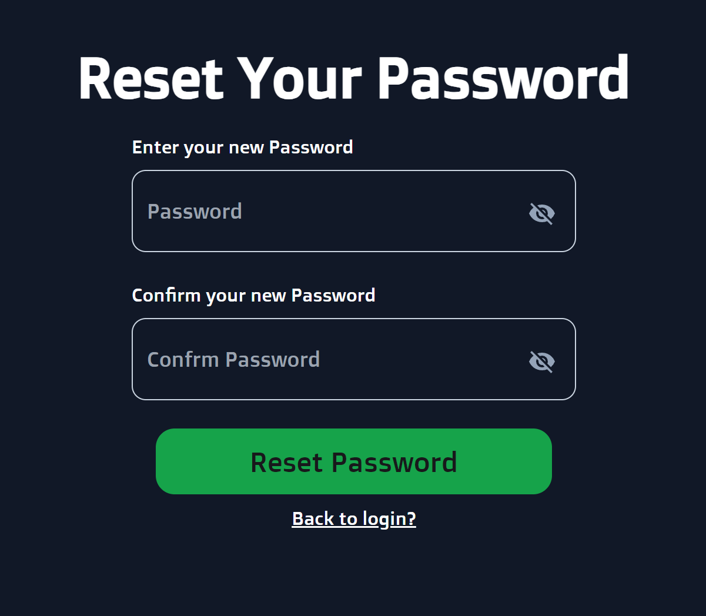{style="height: 325px"}

Enter a new Password and Confirm to change the Password and get back to th Login Page.

### Home Page

Shows a Navbar, a Movie-Banner of a random Movie, Movies in the Watchlist, Movies in Favorites and Movielist with random Movies filtered by genre.
Use the Navigation to change between Pages, search for Movies or access the profile.
Hover above a Movie to show aditional Information or add it to personal favorites, dislikes or watchlist.
Click on a Movie to open the MovieModal.

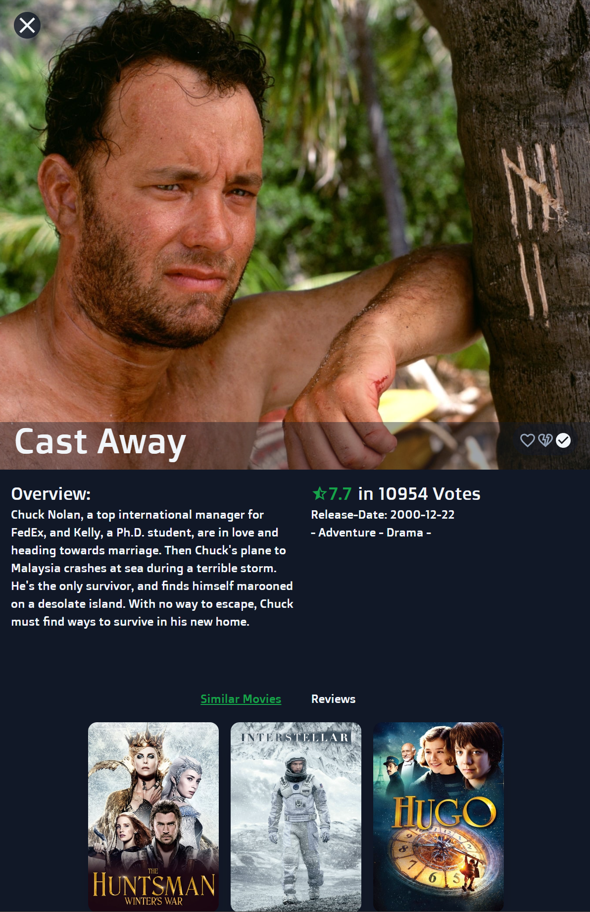{style="height: 525px"} 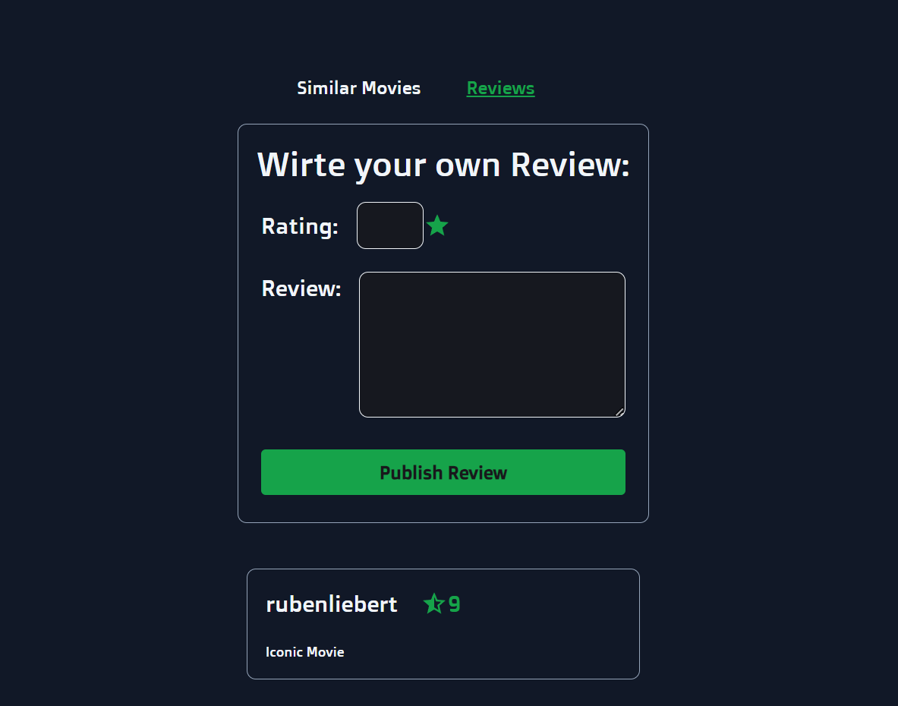{style="height: 525px"}

The Modal show detailed Movie Information and Stats.
Shows similar Movies, that include the same genres.
Write and Publish a Movie Review with Rating and Text.
Read other users Reviews.

### Movies Page

Loads an infintite Scroller of Movies that fetches new Movies when the user scrolls down on the page.
Allows for the filtering of Movies by Genre.
Allows for the sortgin of Movies by Rating, Name and Popularity in ascending and descending order.

### My Movies Page

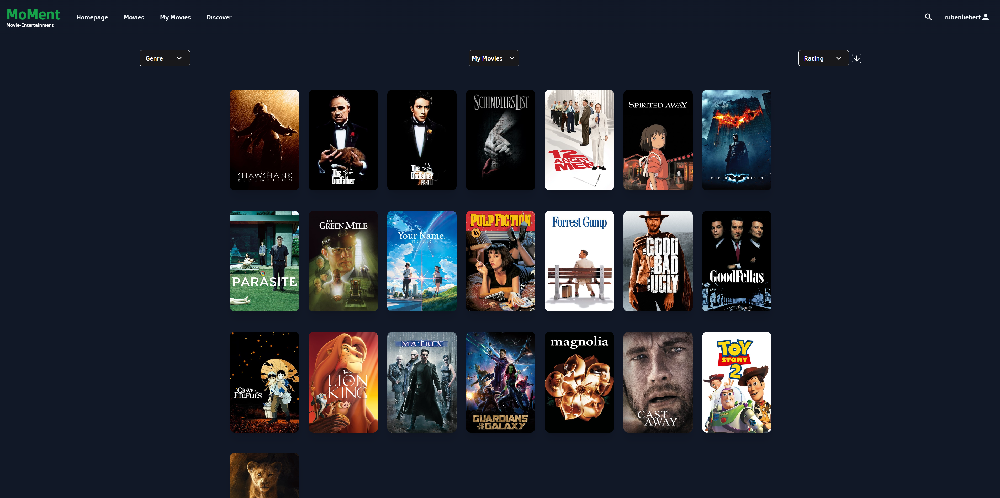

Same Concept as the Movies page but only displays Movies in the current users Likes, Dislikes or Watchlist.
Allows filtering between My Movies, Favorites, Dislikes and Watchlist

### Discover

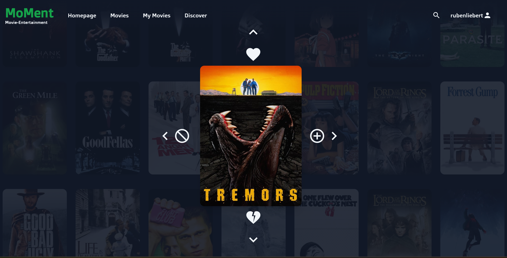

Features a Movie-Discover-Slider.
Get a random Movie and choose to add it to Favorites, Dislikes, Watchlist or get the next random Movie.
Displays MovieInformation when hovering over the Movie poster.

### Profile

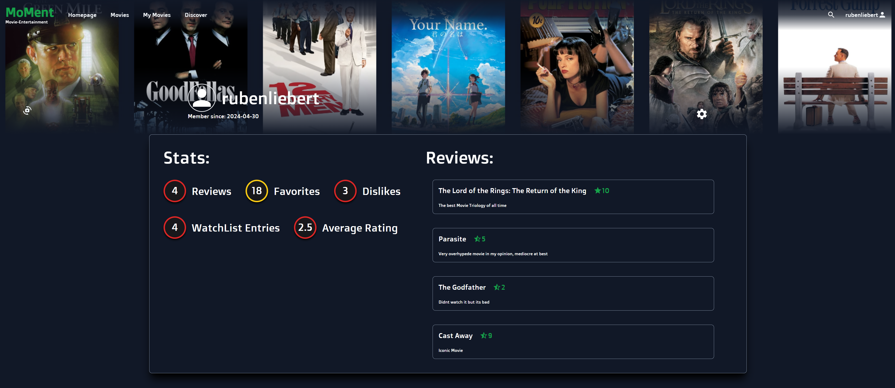

Enables custimization by allowint the user to upload a profile image and profile banner.
Click on the cogwheel to enter settings and for example change your paassword as a logged in user.
Displays Stats and Revies of the Current User.
By exchangeing the username in the pathurl or clicking on the username on a review other users Profiles can be visited as well, but not edited.

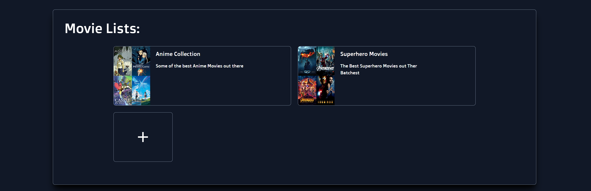

Enables users to create custom Movie Lists to be displayed on the Profile.
A Movie List can also be shared with other users by using its unique link.

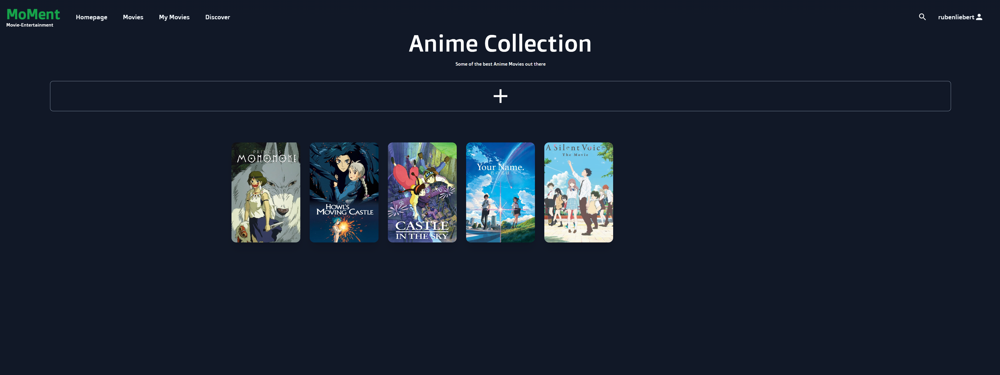

Click on the + on the MoveiList Page to search through all available Movies and add them to the List

### User Authentification

User Authentification was the first feature i started to implement.
Necessary Components:

-  Landing Page
-  Sign IN/UP Page
-  Password Resetting Page

-  not Logged in users get to landing Page first
-  click on Button to get to Sign In/Up
-  change between signing up and signing out by clicking on button
